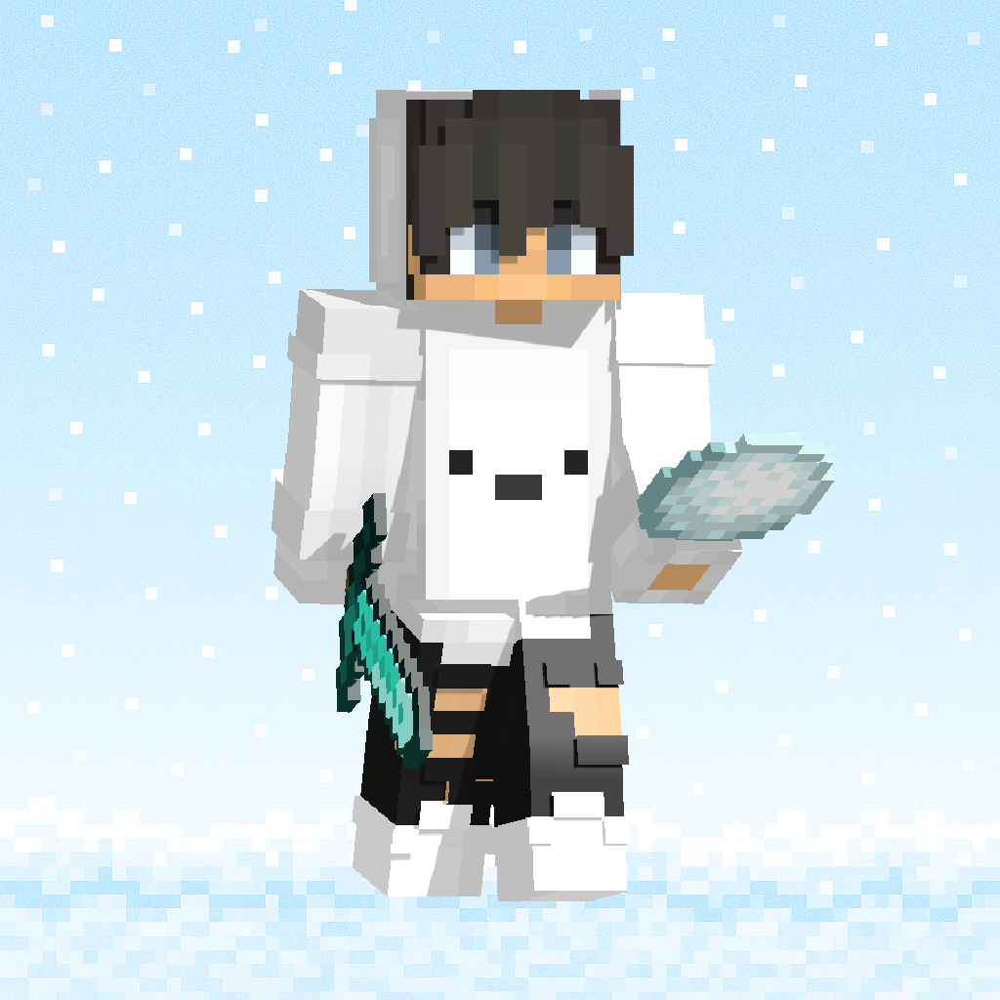

# Florida State Roleplay – Official Website

A modern, responsive, and animated website for the **Florida State Roleplay** server. Built with pure HTML, CSS, and JavaScript. No frameworks or build tools required.


---

## Features

- 🎨 **Premium green glassmorphism UI** with smooth animations
- 📱 **Fully responsive** design for desktop, tablet, and mobile
- ⚡ **Custom loading screen** with animated rings and progress bar
- 🧭 **Floating navigation bar** with active section highlighting
- 👥 **Owners section** with Founder and Website Developer badges
- 🚔 **Departments section** for all roleplay departments
- 📝 **Applications section** (Staff Application & Ban Appeal)
- 📜 **Server rules** section
- 💬 **Discord integration** with styled call-to-action buttons

---

## Project Structure

```
fsrp-web/
├── index.html      # Main landing page
├── styles.css      # All styles, animations, and responsive design
├── app.js          # Loader, navbar, scroll animations, mobile menu
├── logo.png        # Server logo
├── pfp222.png      # Kubiczek2758 avatar
├── lucky.png       # lucky_blade18 avatar
└── README.md       # This file
```

---

## Getting Started

1. Clone or download the repository.
2. Open `index.html` in your browser.
3. To test locally with a server, run:

```bash
python -m http.server 8080
```

Then visit: `http://localhost:8080`

---

## Customization

### Change content

Edit `index.html` directly. All text is static HTML.

### Change colors

The color palette is defined as CSS variables at the top of `styles.css`:

```css
:root {
  --green-500: #10b981;
  --accent: #facc15;
  --discord: #5865f2;
  /* ... */
}
```

### Change owners

Edit the owner cards directly in `index.html`:

```html
<div class="owner-card reveal" data-owner="kubiczek">
  
  <div class="owner-name">Kubiczek2758</div>
  <div class="owner-roles">
    <div class="owner-role">Founder</div>
    <div class="owner-role role-dev">Website Developer</div>
  </div>
</div>
```

---

## Credits

**Website made by [Kubiczek2758](https://discord.gg/pcP85r22KW)**

Server owners:
- **Kubiczek2758** – Founder & Website Developer
- **lucky_blade18** – Founder

---

## License

This project is private and created for the Florida State Roleplay community.
